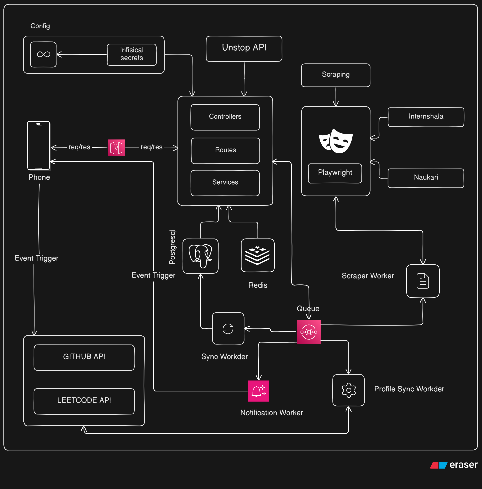

# PERSONAL JOB PORTAL

## Problem Statement
> Most of the people daily apply for jobs in 5 to 6 web portals and it is very difficult and frustrating to switch sites, find relevant jobs or internships and register. 
Hence I decided to create my personalized job portal that helps me to scrape all the jobs in real-time to my user dashboard and can be listed based on the type of category I prefer. It consists of history of registered jobs and also keeps track of daily consistent registrations. 
It uses cron job to automate the scraping process and directly fetch user scheduled jobs / internships into the dashboard.

## Techstack

    <u><h3 style="display:flex; justify-content:center;">Frontend</h3></u>

1) Flutter
2) Block Architecture

    <u><h3 style="display:flex; justify-content:center;">Backend</h3></u>

1) Node.JS
2) Express.jS
3) Supabase
4) Playwrite
5) Infisical

## Architecture
